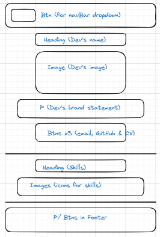
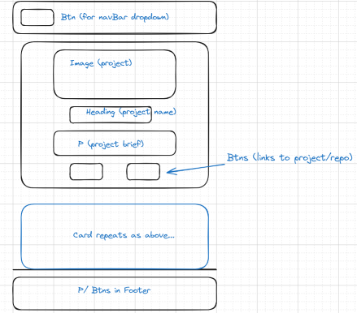
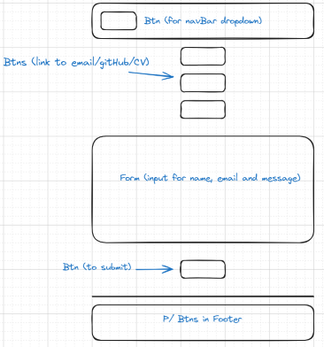
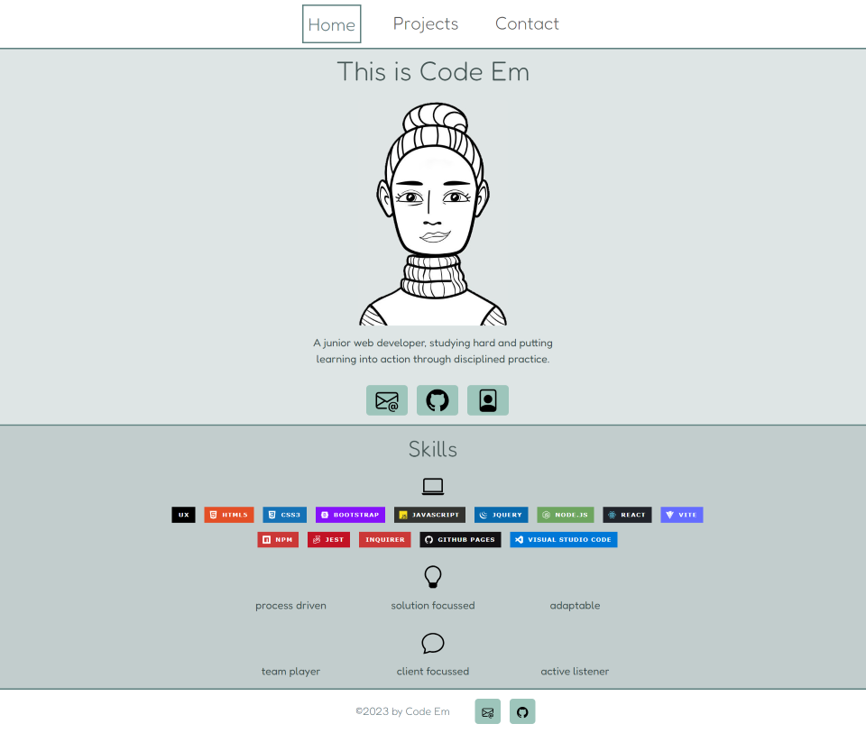
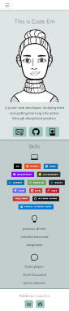

# Web Developer’s Professional Page (React)

## Contents

* [Description](#description)
* [Build](#build)
* [Design](#design)
* [Installation](#installation)
* [Usage](#usage)
* [Credits](#credits)
* [License](#license)
* [Acknowledgments](#acknowledgments)
* [References](#references)

## Description

This project is an iteration of the [Web Developer’s Professional Page (2023)](https://code0em.github.io/webdev-professional-page/) and [Web Developer’s Professional Page (Bootstrap) (2023)](https://code0em.github.io/webdev-professional-page-bs/).

Further to previous iterations, the project brief specified that the website should make use of `React` and `React Router` for dynamic rendering. As a minimum, six components were also required consisting of: 

* **App** (as the top level component, rendering children components)
* **Header** (containing a navbar, and rendered across the entire site)
* **Home**
* **Project Gallery** (dynamically rendering instances of the Project component)
* **Project** (reusable, and ingests JSON data as a props)
* **Contact** (containing a Form for handling events)

## Build

In addition to the above, the website makes use of [Web3Forms API](https://web3forms.com/) for handling the contact form submissions. The website also goes beyond the scope of the project brief, by including additional components (e.g. Skills, Footer, Modal etc) and functionality (e.g. API calls).

The `js` and `jsx` files have been commented throughout to explain the functionality of the code.

## Design

The website was designed with mobile-first design in mind and the site’s colour palette was chosen for its aesthetics; although later adjusted to meet WCAG color requirements.

### Wireframes (resolution of <576px)

Home page:

Projects page:

Contact page:

## Installation

N/A

## Usage

Users navigate to the website via the URL ([Code Em - Web Developer](https://main--code-em.netlify.app/)). When on the home page, users are presented with a navigation bar, profile section, skills section and footer. The profile section includes three buttons, two of which link to external sites (email and gitHub) and one prompts a file download (CV).

The navigation bar and footer are displayed on each page of the site. As users navigate to different pages, the styling of the navigation bar updates (indicating which page the user is currently on).

On the projects page, several cards are displayed; each of which includes an image of the project, a shortened version of the project brief and (where applicable) buttons which link to the deployed application and repository.

A fully functional contact form is displayed on the contact page, alongside buttons which (again) link to external sites (email and gitHub) and file download (CV). The contact form includes validation on each input field. If the user completes the form incorrectly, a modal with an error message is displayed. When the form is completed successfully and a message is submitted, a modal with a pending/ confirmation message is displayed.

The website is fully responsive and adjusts for different screen sizes and viewports. As an example, the home page displays as follows:

On a resolution of 1400px:

On a resolution of 375px:

## Credits

### Design Resources

* **Wireframes (re README)**: Excalidraw (2023) [*Hand-drawn look & feel*](https://excalidraw.com/).
* **Avatar (re Home)**: Anon (no date) [*Avatar Maker*](https://avatarmaker.com/).
* **Badges (re Skills, Projects and README)**: Shields.io (no date) [*Static Badge*](https://shields.io/badges).
* **Icons (re Whole Site)**: Bootstrap (no date) [*Bootstrap Icons - Official open source SVG icon library for Bootstrap*](https://icons.getbootstrap.com/).
* **Colour palette (re Whole Site)**: Coolors (no date) [*The super fast color palettes generator!*](https://coolors.co/).
* **Accessibility Checker (re Whole Site)**: Accessibility Checker (no date) [*Accessibility Color Contrast Checker WCAG Compliance*](https://www.accessibilitychecker.org/color-contrast-checker/).

### Other 

All other credits are cited in the code comments and referenced below.

## License

Select the badge or visit the `LICENSE.txt` (above) for more information.

## Acknowledgments

Code written by Code0Em ([email](mailto:code.em@outlook.com)/ [GitHub](https://github.com/Code0Em)).

## References

lasjorg via freeCodeCamp Forum (2022) [*Closing bootstrap navbar on click of link*](https://forum.freecodecamp.org/t/closing-bootstrap-navbar-on-click-of-link/499339).

Medium (2022) [*How to Open a Link in a New Tab in React*](https://medium.com/coding-beauty/react-open-link-in-new-tab-b48fca2ce86f).

Net Ninja (2023) [*React Router in Depth*](https://www.youtube.com/watch?v=XN7E5tKM-no).

Saeed Rohani via Stack Overflow (2020) [*React-router scroll to top on every transition*](https://stackoverflow.com/questions/36904185/react-router-scroll-to-top-on-every-transition).

Web3Forms Documentation (no date) [*Simple React Contact Form*](https://docs.web3forms.com/how-to-guides/js-frameworks/react-js/simple-react-contact-form).

 Web3Forms Documentation (no date) [*Troubleshooting*](https://docs.web3forms.com/getting-started/troubleshooting#cors-error).

Xpert Learning Assistant (2024) (accessed via Virtual Learning Environment).